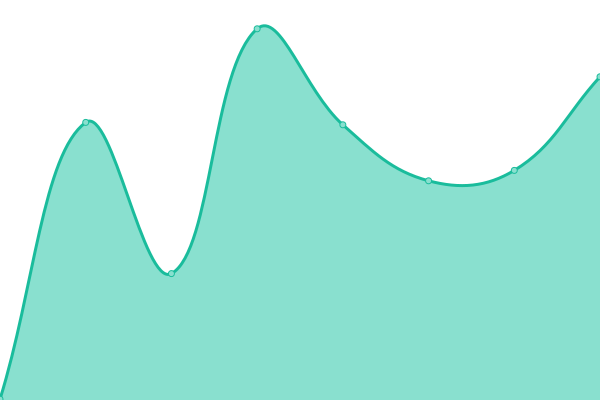
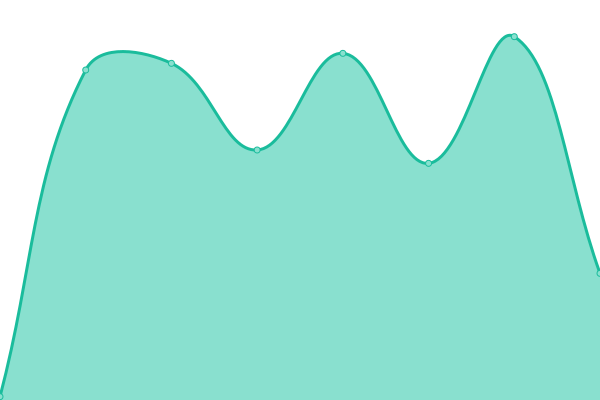
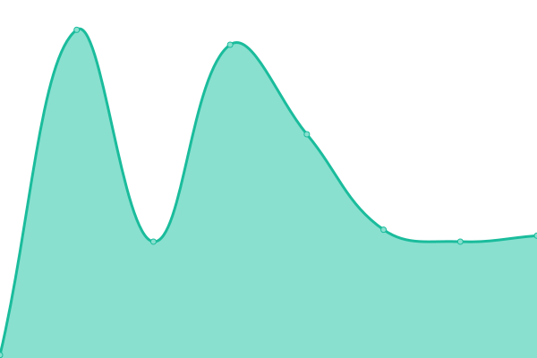
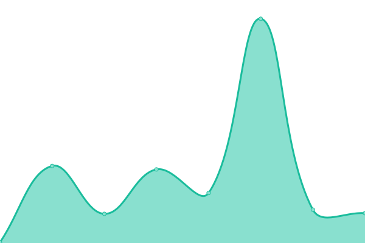
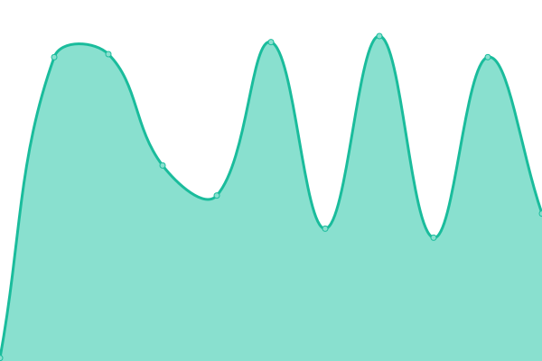

# Fraternity IT Service Status

Public uptime monitor and status page for IHQ IT Committee systems, powered by [Upptime](https://upptime.js.org).

## Live Status: <!--live status--> **🟥 Complete outage**

<!--start: status pages-->
<!-- This summary is generated by Upptime (https://github.com/upptime/upptime) -->
<!-- Do not edit this manually, your changes will be overwritten -->
<!-- prettier-ignore -->
| URL | Status | History | Response Time | Uptime |
| --- | ------ | ------- | ------------- | ------ |
|  iMIS Authentication | 🟥 Down | [i-mis-authentication.yml](https://github.com/OPPF-IHQ-IT/systems-status/commits/HEAD/history/i-mis-authentication.yml) | 

 0ms
     
 | 

<a href="https://status.wrmj.io/history/i-mis-authentication">3.51%</a>
    

|  iMIS IQA | 🟥 Down | [i-mis-iqa.yml](https://github.com/OPPF-IHQ-IT/systems-status/commits/HEAD/history/i-mis-iqa.yml) | 

 0ms
     
 | 

<a href="https://status.wrmj.io/history/i-mis-iqa">0.00%</a>
    

|  Chapter Roster Report | 🟥 Down | [chapter-roster-report.yml](https://github.com/OPPF-IHQ-IT/systems-status/commits/HEAD/history/chapter-roster-report.yml) | 

 0ms
     
 | 

<a href="https://status.wrmj.io/history/chapter-roster-report">0.00%</a>
    

|  Financial Summary Report | 🟥 Down | [financial-summary-report.yml](https://github.com/OPPF-IHQ-IT/systems-status/commits/HEAD/history/financial-summary-report.yml) | 

 0ms
     
 | 

<a href="https://status.wrmj.io/history/financial-summary-report">0.00%</a>
    

|  Zendesk API | 🟥 Down | [zendesk-api.yml](https://github.com/OPPF-IHQ-IT/systems-status/commits/HEAD/history/zendesk-api.yml) | 

 0ms
     
 | 

<a href="https://status.wrmj.io/history/zendesk-api">5.00%</a>
    

<!--end: status pages-->

## Monitored Services

| Service                  | Endpoint                                 |
| ------------------------ | ---------------------------------------- |
| iMIS Authentication      | `/health/imis/auth`                      |
| iMIS IQA                 | `/health/imis/iqa`                       |
| Chapter Roster Report    | `/health/imis/reports/chapter-roster`    |
| Financial Summary Report | `/health/imis/reports/financial-summary` |
| Zendesk API              | `/health/zendesk/api`                    |

Health checks are served by the [observability bridge](https://github.com/OPPF-IHQ-IT/observability) running on Google Cloud Run. Each endpoint reads from a durable cache (TursoDB) — no live upstream calls are made on every check.

## Setup

### Required GitHub Actions Secrets

Add these in **Settings → Secrets and variables → Actions**:

| Secret                 | Value                                                                                      |
| ---------------------- | ------------------------------------------------------------------------------------------ |
| `OBSERVABILITY_HOST`   | Hostname of the deployed bridge (e.g. `observability.wrmj.io`)                             |
| `UPPTIME_HEALTH_TOKEN` | Bearer token matching `UPPTIME_HEALTH_TOKEN` in the bridge's Secret Manager                |
| `GH_PAT`               | GitHub personal access token with `repo` scope (required by Upptime to commit status data) |

### Status Page

The status page publishes to GitHub Pages at `status.wrmj.io` via the `cname` in `.upptimerc.yml`. Configure the custom domain under **Settings → Pages** once the first workflow run completes.

## How It Works

GitHub Actions runs on a schedule (every 5 minutes) to ping each `/health/*` endpoint. When a check fails, an issue is opened automatically. When it recovers, the issue closes. Response time history is committed to the `history/` directory and graphed on the status page.

## License

- Code: [MIT](./LICENSE)
- Uptime data in `./history`: [Open Database License](https://opendatacommons.org/licenses/odbl/1-0/)
